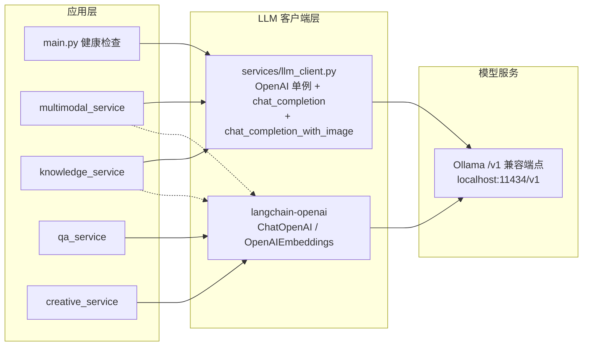

## 用户需求

将工程中所有 Ollama 直接调用（4 处 `ollama.Client(host=OLLAMA_BASE_URL)`）与 langchain_ollama 调用（6 处 `ChatOllama`/`OllamaEmbeddings`）统一改造为 OpenAI 兼容 Chat Completions API，目标为本地 Ollama 的 `/v1` 兼容端点（如 `http://localhost:11434/v1`），api_key 使用占位值，现有本地模型与向量库保持不变，彻底移除 `ollama` 依赖。

## 核心功能

- 4 处 `ollama.Client` 调用改造：main.py 健康检查、multimodal 图片描述与综合分析报告、knowledge RAG 问答
- langchain 侧 4 个 service 文件改用 `langchain-openai`（`ChatOpenAI`/`OpenAIEmbeddings`），删除 `langchain-ollama` 与 `ollama` 依赖
- 多模态图片经 base64 data URI 传入 Chat Completions（Ollama `/v1` 支持 OpenAI 图片格式）
- 嵌入模型名不变（bge-m3、nomic-embed-text），已有 Chroma 向量库直接加载、无需重建
- 依赖文件、Docker 部署配置、README 同步更新

## 技术选型

- OpenAI 官方 Python SDK（`openai>=1.0.0`）对接本地 Ollama `/v1/chat/completions` 与 `/v1/models`
- `langchain-openai`（`ChatOpenAI`/`OpenAIEmbeddings`）替换 `langchain-ollama`，保持现有 RAG 管道结构不变
- 目标端点：`OPENAI_API_BASE` 默认派生自 `OLLAMA_BASE_URL + "/v1"`，`OPENAI_API_KEY` 默认占位 `"ollama"`（本地 Ollama 忽略 key 内容）

## 实施方法

先新增统一配置与客户端封装层，再逐文件替换调用点（先直接调用、后 langchain 侧），最后清理依赖并自测。

### 关键决策

1. **配置双环境变量**：`config.py` 新增 `OPENAI_API_BASE = os.getenv("OPENAI_API_BASE", f"{OLLAMA_BASE_URL}/v1")`、`OPENAI_API_KEY = os.getenv("OPENAI_API_KEY", "ollama")`。Docker 部署时 compose 已设置 `OLLAMA_BASE_URL`，派生逻辑使部署零改动；同时保留独立覆盖能力（未来切第三方服务只改环境变量）。
2. **新建 `services/llm_client.py` 统一封装**：main/multimodal/knowledge 三处复用的 OpenAI 客户端（单例连接复用）、文本补全、带图补全、base64 编码集中管理，避免重复代码，符合 SoC。
3. **图片传递**：OpenAI SDK 不会自动编码本地文件，必须在封装内手动 `base64.b64encode` 生成 `data:image/jpeg;base64,...` URI，Ollama `/v1/chat/completions` 原生支持该格式（llava 模型可用）。
4. **langchain 替换保持管道不变**：`ChatOllama` → `ChatOpenAI`、`OllamaEmbeddings` → `OpenAIEmbeddings`，仅换导入与构造参数（`base_url=OPENAI_API_BASE, api_key=OPENAI_API_KEY`），Runnable 链结构、检索逻辑、返回结构零改动。嵌入模型名不变，已有 db 直接加载。
5. **健康检查**：`ollama.Client(...).list()` → `get_openai_client().models.list()`（Ollama `/v1/models` 支持），日志提示语保留。

### 性能与可靠性

- OpenAI 客户端为单例，底层连接复用，无额外开销；错误处理沿用现有 `try/except` 返回 `{"success": False, "error": str(e)}` 结构，接口契约不变
- 依赖锁定：`requirements-docker.txt` 中删除 `langchain-ollama`/`ollama`，新增 `langchain-openai`/`openai`，实施时以 `pip show` 查询本地版本锁定，保证与已有向量库/运行环境一致

### 架构设计



## 实现注意

- `OpenAIEmbeddings` 新版构造参数为 `base_url`（旧 `openai_api_base` 已弃用），实施时用 `lsp-code-analysis` 确认本地 `langchain-openai` 版本签名
- 图片补全中 `description` 需先经 `Image.open().convert("RGB")` 预处理（沿用现有逻辑），再编码为 JPEG base64
- 全局搜索确认无 `ollama`/`langchain_ollama` 残留后收尾
- README 部署方案说明同步更新（依赖清单、OpenAI 协议、环境变量）

## 目录结构

```
FastapiService/
├── config.py                      # [MODIFY] 新增 OPENAI_API_BASE/OPENAI_API_KEY（env 可覆盖，默认派生自 OLLAMA_BASE_URL）
├── main.py                        # [MODIFY] 健康检查改为 get_openai_client().models.list()，删除 import ollama
├── requirements.txt               # [MODIFY] 删 langchain-ollama/ollama，加 langchain-openai/openai
├── requirements-docker.txt        # [MODIFY] 同上，锁定本地版本
├── docker-compose.yml             # [MODIFY] 增加 OPENAI_API_BASE/OPENAI_API_KEY 环境变量传递（默认派生，可独立覆盖）
├── README.md                      # [MODIFY] 同步更新依赖与 OpenAI 协议部署说明
├── services/
│   ├── llm_client.py              # [NEW] OpenAI 客户端统一封装：get_openai_client 单例、chat_completion、chat_completion_with_image、encode_image
│   ├── qa_service.py              # [MODIFY] ChatOllama→ChatOpenAI、OllamaEmbeddings→OpenAIEmbeddings
│   ├── creative_service.py        # [MODIFY] 同上
│   ├── multimodal_service.py      # [MODIFY] 删除 ollama import；两处 generate→llm_client；OllamaEmbeddings→OpenAIEmbeddings
│   └── knowledge_service.py       # [MODIFY] 删除 ollama import；query 中 generate→llm_client；OllamaEmbeddings→OpenAIEmbeddings
```

## 关键代码结构

```python
# services/llm_client.py（多模块依赖的统一契约，仅接口签名）
from openai import OpenAI

def get_openai_client() -> OpenAI:
    """返回 OpenAI 客户端单例（base_url=OPENAI_API_BASE, api_key=OPENAI_API_KEY）"""

def chat_completion(model: str, prompt: str, temperature: float = 0.7) -> str:
    """文本补全：POST /v1/chat/completions，返回 choices[0].message.content"""

def chat_completion_with_image(model: str, text: str, image_path: str, temperature: float = 0.7) -> str:
    """带图补全：图片 base64 编码为 data URI 放入 content[].image_url，返回文本"""

def encode_image(image_path: str) -> str:
    """读取本地图片并返回 base64 字符串"""
```

## Agent Extensions

### Skill

- **lsp-code-analysis**
- 用途：确认本地 `langchain-openai` 中 `ChatOpenAI`/`OpenAIEmbeddings` 的构造参数签名（`base_url` vs 弃用的 `openai_api_base`），避免按错误参数实现
- 预期结果：以本地已安装版本的 API 签名为准完成 langchain 替换，确保构造代码可运行